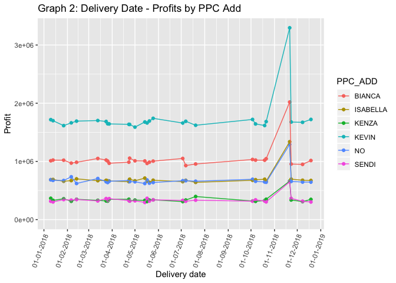
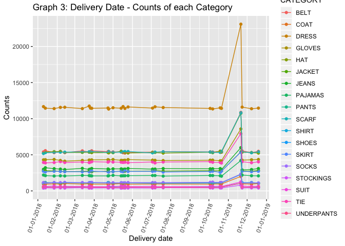
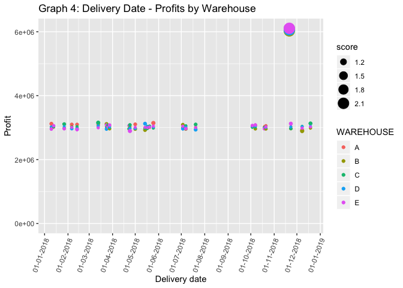
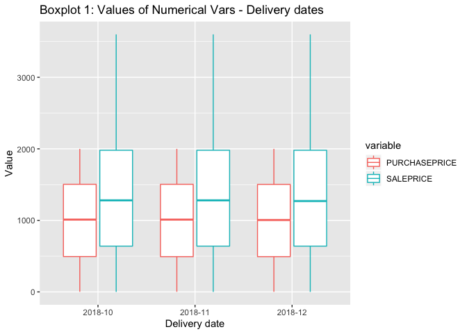

KPMG: Case 029
================
Simon Melamed
2/10/2020

``` r
knitr::opts_chunk$set(echo = TRUE)

### LOAD REQUIRED PACKAGES
pacman::p_load(gridExtra, tidyverse, lubridate, textreadr, knitr, FNN, kableExtra, scales, dbscan, reshape2, cluster)
```

``` r
### READ IN DATA FROM CHOSEN FOLDER

### Detect files in folder
files_in_folder <- list.files(path = "../CaseData_2020_ID029", pattern = "\\.txt$", full.names = TRUE)

### Read in the files to a list using map and read.delim
data <- map(files_in_folder, read.delim, sep = "|", na.strings = c("NA", "NAs", "", " ", "NULL")) 

### Separate the list of data and save each set in their on data frame
customer_db <- data[[1]]

items_db <- data[[2]]

transactions_db <- data[[3]]
```

This chunk of code reads in all of the .txt files in the chosen folder
path, this can be changed in the future to download other files in other
folders.

``` r
### DATA PREPARATION

### Join the data for analysis and change class of certain columns
all_data <- items_db %>%
            select(-SUPLID) %>% # Redundant column
            distinct() %>% # Necessary for the join
            full_join(transactions_db, by = "ITEM") %>% # Transactions and item dbs is connected by itemid
            full_join(customer_db, by = "USERID") %>% # Customer and transaction dbs is connected by userid
            mutate(SALEPRICE = as.numeric(SALEPRICE), # Change columns to appropriate class
                   DELIVERYDATE = as.Date(as.character(DELIVERYDATE)),
                   DOB = as.Date(DOB))
```

This chunk of code prepares the data for analysis and join the datasets
together to one dataset; all\_data.

``` r
### DATA EXPLORATION

### Explore missing values for variables
nas_table <- all_data %>% 
       map_df(~sum(is.na(.))) %>% #Counts # of NAS for each variable
       gather(key = "Variable", value = "Number of NAs") %>% # From wide to long format
       arrange(desc(`Number of NAs`)) %>% # Arrange the # of NAs for each variable in descending order
       kable(caption = "Table 1: Variables containing missing values") %>% 
             kable_styling(bootstrap_options = "striped", 
             full_width = FALSE,
             position = "left") # Present the data frame nicely

nas_table
```

<table class="table table-striped" style="width: auto !important; ">

<caption>

Table 1: Variables containing missing values

</caption>

<thead>

<tr>

<th style="text-align:left;">

Variable

</th>

<th style="text-align:right;">

Number of NAs

</th>

</tr>

</thead>

<tbody>

<tr>

<td style="text-align:left;">

RATING

</td>

<td style="text-align:right;">

566753

</td>

</tr>

<tr>

<td style="text-align:left;">

PAYMENT

</td>

<td style="text-align:right;">

438436

</td>

</tr>

<tr>

<td style="text-align:left;">

EDUCATION

</td>

<td style="text-align:right;">

421767

</td>

</tr>

<tr>

<td style="text-align:left;">

WAREHOUSE

</td>

<td style="text-align:right;">

364427

</td>

</tr>

<tr>

<td style="text-align:left;">

REVIEW

</td>

<td style="text-align:right;">

219272

</td>

</tr>

<tr>

<td style="text-align:left;">

SHIPDAYS

</td>

<td style="text-align:right;">

219189

</td>

</tr>

<tr>

<td style="text-align:left;">

PURCHASE

</td>

<td style="text-align:right;">

218913

</td>

</tr>

<tr>

<td style="text-align:left;">

QTY

</td>

<td style="text-align:right;">

199101

</td>

</tr>

<tr>

<td style="text-align:left;">

WEBBROWSER

</td>

<td style="text-align:right;">

146192

</td>

</tr>

<tr>

<td style="text-align:left;">

DELIVERYDATE

</td>

<td style="text-align:right;">

75492

</td>

</tr>

<tr>

<td style="text-align:left;">

HOBBY

</td>

<td style="text-align:right;">

71732

</td>

</tr>

<tr>

<td style="text-align:left;">

TIMESTAMP

</td>

<td style="text-align:right;">

36655

</td>

</tr>

<tr>

<td style="text-align:left;">

DISCOUNT

</td>

<td style="text-align:right;">

21731

</td>

</tr>

<tr>

<td style="text-align:left;">

PPC\_ADD

</td>

<td style="text-align:right;">

15482

</td>

</tr>

<tr>

<td style="text-align:left;">

USERID

</td>

<td style="text-align:right;">

3803

</td>

</tr>

<tr>

<td style="text-align:left;">

GENDER

</td>

<td style="text-align:right;">

3803

</td>

</tr>

<tr>

<td style="text-align:left;">

DOB

</td>

<td style="text-align:right;">

3803

</td>

</tr>

<tr>

<td style="text-align:left;">

COUNTRY

</td>

<td style="text-align:right;">

3803

</td>

</tr>

<tr>

<td style="text-align:left;">

PURCHASEPRICE

</td>

<td style="text-align:right;">

216

</td>

</tr>

<tr>

<td style="text-align:left;">

SALEPRICE

</td>

<td style="text-align:right;">

216

</td>

</tr>

<tr>

<td style="text-align:left;">

TRACKNO

</td>

<td style="text-align:right;">

9

</td>

</tr>

<tr>

<td style="text-align:left;">

ITEM

</td>

<td style="text-align:right;">

0

</td>

</tr>

<tr>

<td style="text-align:left;">

CATEGORY

</td>

<td style="text-align:right;">

0

</td>

</tr>

<tr>

<td style="text-align:left;">

COLOR

</td>

<td style="text-align:right;">

0

</td>

</tr>

</tbody>

</table>

In Table 1, each variable’s number of missing values is listed. It turns
out that rating, payment and education are the variables that has the
most number of missing values in the dataset. This could be of interest
to the client in order to further investigate why this is the case. If
this would be assessed then the reliability of the data would be
increased.

``` r
### Insights from barcharts 

### Following code creates barcharts for all categorical variables
bar_1 <-   all_data %>% 
           filter(PURCHASE == "YES") %>% # Filter for transactions that went through
           group_by(HOBBY) %>% # Group by hobby to count the number of occurences for each hobby
           summarise(counts = n()) %>%
           arrange(counts) %>%
           ggplot(aes(x = reorder(HOBBY, counts), y= counts)) + # Order the bars nicely
           labs(y = "Count", x = "Hobby", title = "Barchart 1: Counts of Hobbies") + # Labels and titles for the bar chart
           geom_bar(stat="identity",fill="steelblue") + # Aestetics 
           theme_minimal() +
           coord_flip()
```

    ## Warning: Factor `HOBBY` contains implicit NA, consider using
    ## `forcats::fct_explicit_na`

``` r
bar_2 <-   all_data %>% 
           filter(PURCHASE == "YES") %>%
           group_by(PPC_ADD) %>%
           summarise(counts = n()) %>%
           arrange(counts) %>%
           ggplot(aes(x = reorder(PPC_ADD, counts), y= counts)) + 
           labs(y = "Count", x = "PPC add", title = "Barchart 2: Counts of PPC add") +
           geom_bar(stat="identity",fill="steelblue") +
           theme_minimal() +
           coord_flip()
```

    ## Warning: Factor `PPC_ADD` contains implicit NA, consider using
    ## `forcats::fct_explicit_na`

``` r
bar_3 <-   all_data %>% 
           filter(PURCHASE == "YES") %>%
           group_by(CATEGORY) %>%
           summarise(counts = n()) %>%
           arrange(counts) %>%
           ggplot(aes(x = reorder(CATEGORY, counts), y= counts)) + 
           labs(y = "Count", x = "Category", title = "Barchart 3: Counts of each category") +
           geom_bar(stat="identity",fill="steelblue") +
           theme_minimal() +
           coord_flip()

bar_4 <-   all_data %>% 
           filter(PURCHASE == "YES") %>% 
           group_by(COLOR) %>%
           summarise(counts = n()) %>%
           arrange(counts) %>%
           ggplot(aes(x = reorder(COLOR, counts), y= counts)) + 
           labs(y = "Count", x = "Color", title = "Barchart 4: Counts of each color") +
           geom_bar(stat="identity",fill="steelblue") +
           theme_minimal() +
           coord_flip()

bar_5 <-   all_data %>% 
           filter(PURCHASE == "YES") %>%
           group_by(WEBBROWSER) %>%
           summarise(counts = n()) %>%
           arrange(counts) %>%
           ggplot(aes(x = reorder(WEBBROWSER, counts), y= counts)) + 
           labs(y = "Count", x = "Webbrowser", title = "Barchart 5: Counts of webbrowsers") +
           geom_bar(stat="identity",fill="steelblue") +
           theme_minimal() +
           coord_flip()
```

    ## Warning: Factor `WEBBROWSER` contains implicit NA, consider using
    ## `forcats::fct_explicit_na`

``` r
bar_6 <-   all_data %>% 
           filter(PURCHASE == "YES") %>%
           group_by(QTY) %>%
           summarise(counts = n()) %>%
           arrange(counts) %>%
           ggplot(aes(x = reorder(QTY, counts), y= counts)) + 
           labs(y = "Count", x = "Quantity", title = "Barchart 6: Counts of quantites") +
           geom_bar(stat="identity",fill="steelblue") +
           theme_minimal() +
           coord_flip()

bar_7 <-   all_data %>% 
           filter(PURCHASE == "YES") %>%
           group_by(PAYMENT) %>%
           summarise(counts = n()) %>%
           arrange(counts) %>%
           ggplot(aes(x = reorder(PAYMENT, counts), y= counts)) + 
           labs(y = "Count", x = "Payment", title = "Barchart 7: Counts of payment methods") +
           geom_bar(stat="identity",fill="steelblue") +
           theme_minimal() +
           coord_flip()
```

    ## Warning: Factor `PAYMENT` contains implicit NA, consider using
    ## `forcats::fct_explicit_na`

``` r
bar_8 <-   all_data %>% 
           filter(PURCHASE == "YES") %>%
           group_by(WAREHOUSE) %>%
           summarise(counts = n()) %>%
           arrange(counts) %>%
           ggplot(aes(x = reorder(WAREHOUSE, counts), y= counts)) +
           labs(y = "Count", x = "Warehouse", title = "Barchart 8: Counts of warehouse") +
           geom_bar(stat="identity",fill="steelblue") +
           theme_minimal() +
           coord_flip()
```

    ## Warning: Factor `WAREHOUSE` contains implicit NA, consider using
    ## `forcats::fct_explicit_na`

``` r
bar_9 <-   all_data %>% 
           filter(PURCHASE == "YES") %>%
           group_by(SHIPDAYS) %>%
           summarise(counts = n()) %>%
           arrange(counts) %>%
           ggplot(aes(x = reorder(SHIPDAYS, counts), y= counts)) + 
           labs(y = "Count", x = "Shipdays", title = "Barchart 9: Counts of shipdays") +
           geom_bar(stat="identity",fill="steelblue") +
           theme_minimal() +
           coord_flip()

bar_10 <-  all_data %>% 
           filter(PURCHASE == "YES") %>%
           group_by(REVIEW) %>%
           summarise(counts = n()) %>%
           arrange(counts) %>%
           ggplot(aes(x = reorder(REVIEW, counts), y= counts)) + 
           labs(y = "Count", x = "Review", title = "Barchart 10: Counts of reviews") +
           geom_bar(stat="identity",fill="steelblue") +
           theme_minimal() +
           coord_flip()
```

    ## Warning: Factor `REVIEW` contains implicit NA, consider using
    ## `forcats::fct_explicit_na`

``` r
bar_11 <-  all_data %>%
           filter(PURCHASE == "YES") %>%
           group_by(RATING) %>%
           summarise(counts = n()) %>%
           arrange(counts) %>%
           ggplot(aes(x = reorder(RATING, counts), y= counts)) + 
           labs(y = "Count", x = "Rating", title = "Barchart 11: Counts of ratings") +
           geom_bar(stat="identity",fill="steelblue") +
           theme_minimal() +
           coord_flip()

bar_12 <-  all_data %>% 
           filter(PURCHASE == "YES") %>%
           group_by(GENDER) %>%
           summarise(counts = n()) %>%
           arrange(counts) %>%
           ggplot(aes(x = reorder(GENDER, counts), y= counts)) + 
           labs(y = "Count", x = "Gender", title = "Barchart 12: Counts of each gender") +
           geom_bar(stat="identity",fill="steelblue") +
           theme_minimal() +
           coord_flip()
```

    ## Warning: Factor `GENDER` contains implicit NA, consider using
    ## `forcats::fct_explicit_na`

``` r
bar_13 <-  all_data %>% 
           filter(PURCHASE == "YES") %>%
           group_by(year(DOB)) %>%
           summarise(counts = n()) %>%
           ggplot(aes(x=`year(DOB)`, y=counts)) +
           geom_histogram(stat="identity",fill="steelblue",breaks = 38) +
           labs(y = "Count", x = "Date of Birth", title = "Barchart 13: Counts of date of birth") +
           theme_minimal() 
```

    ## Warning: Ignoring unknown parameters: binwidth, bins, pad, breaks

``` r
bar_14 <-  all_data %>% 
           filter(PURCHASE == "YES") %>%
           group_by(COUNTRY) %>%
           summarise(counts = n()) %>%
           arrange(counts) %>%
           ggplot(aes(x = reorder(COUNTRY, counts), y= counts)) + 
           labs(y = "Count", x = "Country", title = "Barchart 14: Counts of each country") +
           geom_bar(stat="identity",fill="steelblue") +
           theme_minimal() +
           coord_flip()
```

    ## Warning: Factor `COUNTRY` contains implicit NA, consider using
    ## `forcats::fct_explicit_na`

``` r
bar_15 <-  all_data %>% 
           filter(PURCHASE == "YES") %>%
           group_by(EDUCATION) %>%
           summarise(counts = n()) %>%
           arrange(counts) %>%
           ggplot(aes(x = reorder(EDUCATION, counts), y= counts)) + 
           labs(y = "Count", x = "Education", title = "Barchart 15: Counts of education-levels") +
           geom_bar(stat="identity",fill="steelblue") +
           theme_minimal() +
           coord_flip()
```

    ## Warning: Factor `EDUCATION` contains implicit NA, consider using
    ## `forcats::fct_explicit_na`

``` r
### Visualize 4 of the bar charts in a grid
grid.arrange(bar_2, bar_4, bar_5, bar_6) 
```

<!-- -->

Above I’ve created barcharts for all categorical variables, but only
chosen to print a few for illustration. These barcharts give great
insight of the distribution of each variable and can possibly bring
insight of the customers’ profile to the client. For example, in
Barchart 2, it becomes evident that Kevin has sold the most articles.
Whereas in Barchart 4 we can see that the color gold is most prominent
in the dataset. In Barchart 5 it’s noticable that the mobile app is more
used than other web browsers, and in Barchart 6 we notice that the most
usual quantity of a transaction is 2.

``` r
### GRAPHS

### Creates a graph with delivery date on the x-axis and the counts of transactions that day on the y-axis
graph_1 <-     all_data %>%
               filter(PURCHASE == "YES") %>%
               group_by(DELIVERYDATE) %>%
               summarise(n_transactions = n()) %>%
               drop_na %>% # There's one delivery-date that is a NA
               ggplot(aes(x=DELIVERYDATE, y=n_transactions)) + 
               geom_point() +
               geom_line()+
               labs(x="Delivery date", y="Number of transactions", title = "Graph 1: Delivery Date - Transactions") +
               expand_limits(y = 0) +
               scale_x_date(date_breaks = "1 month", date_labels = "%d-%m-%Y") +
               theme(axis.text.x = element_text(angle=70, hjust=1))+
               geom_label(label="2018-11-21", x=as.Date("2018-11-21"), y=106086)

graph_1
```

<!-- -->

From Graph 1, it is clear that the number of transactions seem to be
quite constant for each delivery date, except for an anomaly on 21st of
November 2018. It’s appropriate to investigate this further.

``` r
### Creates a graph that illustrates the profits made by each PPC add.
graph_2 <- all_data %>%
           filter(PURCHASE == "YES") %>%
           group_by(DELIVERYDATE, PPC_ADD) %>%
           drop_na() %>%
           summarise(profit = sum(SALEPRICE,na.rm = TRUE)-sum(PURCHASEPRICE,na.rm = TRUE)) %>%
           ggplot(aes(x = DELIVERYDATE, y = profit, color = PPC_ADD)) + 
           geom_point() +
           geom_line()+
           labs(x="Delivery date", y="Profit", title = "Graph 2: Delivery Date - Profits by PPC Add") +
           scale_x_date(date_breaks = "1 month", date_labels = "%d-%m-%Y") +
           expand_limits(y = 0) +
           theme(axis.text.x = element_text(angle=70, hjust=1))
```

    ## Warning: Factor `PPC_ADD` contains implicit NA, consider using
    ## `forcats::fct_explicit_na`

``` r
graph_2
```

<!-- -->

From Graph 2 we can see that each of the influencer’s profits remain
remotely constant for each delivery date, expect for a jump for all of
them on 21st of November 2018, which now strongly should be considered
an anomaly. In Graph 2 it becomes more clear that the devlivery days are
not evenly spread out during the year, for example were there no
delivery dates August 2018 at all. It also illustrates the different
levels of profit each influencer generates, with Kevin at the top.

To further the investigation of the anomaly, was it a specific category
of items that is the reason for this spike? For example, a new popular
dress?

``` r
### Creates a graph that counts the number of transactions for each category

graph_3 <- all_data %>%
           filter(PURCHASE == "YES") %>%
           group_by(DELIVERYDATE, CATEGORY) %>%
           summarise(counts = n()) %>% 
           drop_na() %>%
           ggplot(aes(x = DELIVERYDATE, y = counts, color = CATEGORY)) + 
           geom_point() +
           geom_line()+
           labs(x="Delivery date", y="Counts", title = "Graph 3: Delivery Date - Counts of each Category") +
           scale_x_date(date_breaks = "1 month", date_labels = "%d-%m-%Y") +
           expand_limits(y = 0) +
           theme(axis.text.x = element_text(angle=70, hjust=1))

graph_3
```

<!-- -->

My hypothesis was false, in Graph 3 we can tell that there were an
increase of sales across all categories on 21st of November 2018.

``` r
### ANOMALY DETECTION, Local Outlier Factor-approach

### Creates a dataframe with profits for each deliverydate and warehouse

profit_data <- all_data %>% 
               filter(PURCHASE == "YES") %>%
               group_by(DELIVERYDATE, WAREHOUSE) %>%
               summarise(profit = sum(SALEPRICE,na.rm = TRUE)-sum(PURCHASEPRICE,na.rm = TRUE))
```

    ## Warning: Factor `WAREHOUSE` contains implicit NA, consider using
    ## `forcats::fct_explicit_na`

``` r
### Computes the distance metric for the LOF anomoly detection method, "gower" is chosen 
### since we have both categorical and numerical features 

lof_dist <- daisy(profit_data[,-1], metric = "gower")

### Calculates the LOF score, it uses the k-nearest-neighbour method with k set to 100
lof_score <- lof(lof_dist, k = 100)

### Append the score column to the profit_data
profit_data$score <- lof_score

### Creates a plot that illustrates the LOF-score for each point using different sizes of balls.
plot_anomaly <- profit_data %>% 
                drop_na() %>%
                ggplot(aes(x=DELIVERYDATE, y=profit, size=score, color=WAREHOUSE))+ 
                geom_point()+
                labs(x="Delivery date", y="Profit", title = "Graph 4: Delivery Date - Profits by Warehouse") +
                scale_x_date(date_breaks = "1 month", date_labels = "%d-%m-%Y") +
                expand_limits(y = 0) +
                theme(axis.text.x = element_text(angle=70, hjust=1))


plot_anomaly
```

<!-- -->

In Graph 4 we can note that the points during the anomoly-date, 21st of
November 2018, are bigger than the other points. This implies a larger
LOF-score for these points, and should therefore be considered to be
more anomalous than the other points. LOF-score can be thought of as a
ratio, namely the density around each point’s nearest neighbour (in this
case the closest 100 since we chose k=100), devided by the density
around the point itself. So if the LOF score is higher than 1, the point
is more likely to be anomalous. Whereas if the score is lower than 1 it
is less like to be an anomaly.

``` r
### BOXPLOT OF NUMERICAL VARIABLES

### Modify a dataset to use for the boxplot
box_plot_data <- all_data %>%
                 filter(PURCHASE == "YES") %>%
                 select(DELIVERYDATE,PURCHASEPRICE, SALEPRICE) %>%
                 filter(between(DELIVERYDATE, as.Date("2018-09-01"), as.Date("2019-01-01"))) %>%
                 drop_na() %>%
                 mutate(DELIVERYDATE = format(DELIVERYDATE, "%Y-%m")) %>%
                 melt(id.vars="DELIVERYDATE", measure.vars=c("PURCHASEPRICE", "SALEPRICE"))
                 
### Create the boxplot
box_plot <- ggplot(box_plot_data) +
            geom_boxplot(aes(x=DELIVERYDATE, y=value, color=variable)) +
            ggtitle("Boxplot 1: Values of Numerical Vars - Delivery dates") + 
            labs(x="Delivery date", y="Value")
box_plot        
```

<!-- -->

In Boxplot 1 we can se that there were no change in prices during the
month of the anomaly (November 2018), so an increase in pricing is not
the cause of the anomaly. I conclude that the anomaly lies in the fact
that there were double as many transactions during the date 2018-11-21,
in comparison to another regular delivery date where the number of
transactions remain fairly constant.
