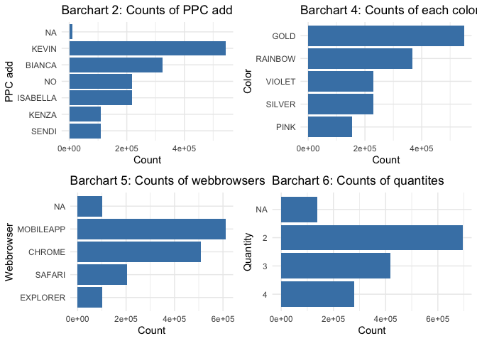

KPMG: Case 029
================
Simon Melamed
2/10/2020

``` r
knitr::opts_chunk$set(echo = TRUE)

### LOAD REQUIRED PACKAGES
pacman::p_load(gridExtra, tidyverse, lubridate, textreadr, knitr, FNN, kableExtra, scales)
```

``` r
### READ IN DATA FROM CHOSEN FOLDER

### Detect files in folder
files_in_folder <- list.files(path = "../CaseData_2020_ID029", pattern = "\\.txt$", full.names = TRUE)

### Read in the files to a list using map and read.delim
data <- map(files_in_folder, read.delim, sep = "|", na.strings = c("NA", "NAs", "", " ", "NULL")) 

### Separate the list of data and save each set in their on data frame
customer_db <- data[[1]]

items_db <- data[[2]]

transactions_db <- data[[3]]
```

This chunk of code reads in all of the .txt files in the chosen folder
path, this can be changed in the future to download other files in other
folders.

``` r
### DATA PREPARATION

### Join the data for analysis and change class of certain columns
all_data <- items_db %>%
            select(-SUPLID) %>% # Redundant column
            distinct() %>% # Necessary for the join
            full_join(transactions_db, by = "ITEM") %>% # Transactions and item dbs is connected by itemid
            full_join(customer_db, by = "USERID") %>% # Customer and transaction dbs is connected by userid
            mutate(SALEPRICE = as.numeric(SALEPRICE), # Change columns to appropriate class
                   TIMESTAMP = hms(as.character(TIMESTAMP)),
                   DELIVERYDATE = as.Date(as.character(DELIVERYDATE)),
                   DOB = as.Date(DOB))
```

    ## Warning in .parse_hms(..., order = "HMS", quiet = quiet): Some strings failed to
    ## parse, or all strings are NAs

This chuck of code prepares the data for analysis and join the datasets
together to one dataset; all\_data.

``` r
### DATA EXPLORATION

### Explore missing values for variables
nas_table <- all_data %>% 
       map_df(~sum(is.na(.))) %>%
       gather(key = "Variable", value="Number of NAs") %>%
       arrange(desc(`Number of NAs`)) %>% # Arrange the # of NAs for each variable in descending order
       kable(caption = "Table 1: Variables containing missing values") %>%
             kable_styling(bootstrap_options = "striped", 
             full_width = FALSE,
             position = "left") # Present the data frame nicely

nas_table
```

<table class="table table-striped" style="width: auto !important; ">

<caption>

Table 1: Variables containing missing values

</caption>

<thead>

<tr>

<th style="text-align:left;">

Variable

</th>

<th style="text-align:right;">

Number of NAs

</th>

</tr>

</thead>

<tbody>

<tr>

<td style="text-align:left;">

RATING

</td>

<td style="text-align:right;">

566753

</td>

</tr>

<tr>

<td style="text-align:left;">

PAYMENT

</td>

<td style="text-align:right;">

438436

</td>

</tr>

<tr>

<td style="text-align:left;">

EDUCATION

</td>

<td style="text-align:right;">

421767

</td>

</tr>

<tr>

<td style="text-align:left;">

WAREHOUSE

</td>

<td style="text-align:right;">

364427

</td>

</tr>

<tr>

<td style="text-align:left;">

REVIEW

</td>

<td style="text-align:right;">

219272

</td>

</tr>

<tr>

<td style="text-align:left;">

SHIPDAYS

</td>

<td style="text-align:right;">

219189

</td>

</tr>

<tr>

<td style="text-align:left;">

PURCHASE

</td>

<td style="text-align:right;">

218913

</td>

</tr>

<tr>

<td style="text-align:left;">

QTY

</td>

<td style="text-align:right;">

199101

</td>

</tr>

<tr>

<td style="text-align:left;">

WEBBROWSER

</td>

<td style="text-align:right;">

146192

</td>

</tr>

<tr>

<td style="text-align:left;">

DELIVERYDATE

</td>

<td style="text-align:right;">

75492

</td>

</tr>

<tr>

<td style="text-align:left;">

HOBBY

</td>

<td style="text-align:right;">

71732

</td>

</tr>

<tr>

<td style="text-align:left;">

TIMESTAMP

</td>

<td style="text-align:right;">

36655

</td>

</tr>

<tr>

<td style="text-align:left;">

DISCOUNT

</td>

<td style="text-align:right;">

21731

</td>

</tr>

<tr>

<td style="text-align:left;">

PPC\_ADD

</td>

<td style="text-align:right;">

15482

</td>

</tr>

<tr>

<td style="text-align:left;">

USERID

</td>

<td style="text-align:right;">

3803

</td>

</tr>

<tr>

<td style="text-align:left;">

GENDER

</td>

<td style="text-align:right;">

3803

</td>

</tr>

<tr>

<td style="text-align:left;">

DOB

</td>

<td style="text-align:right;">

3803

</td>

</tr>

<tr>

<td style="text-align:left;">

COUNTRY

</td>

<td style="text-align:right;">

3803

</td>

</tr>

<tr>

<td style="text-align:left;">

PURCHASEPRICE

</td>

<td style="text-align:right;">

216

</td>

</tr>

<tr>

<td style="text-align:left;">

SALEPRICE

</td>

<td style="text-align:right;">

216

</td>

</tr>

<tr>

<td style="text-align:left;">

TRACKNO

</td>

<td style="text-align:right;">

9

</td>

</tr>

<tr>

<td style="text-align:left;">

ITEM

</td>

<td style="text-align:right;">

0

</td>

</tr>

<tr>

<td style="text-align:left;">

CATEGORY

</td>

<td style="text-align:right;">

0

</td>

</tr>

<tr>

<td style="text-align:left;">

COLOR

</td>

<td style="text-align:right;">

0

</td>

</tr>

</tbody>

</table>

In Table 1, we can see the variables with the most missing values. It
turns out that rating, payment and education are the variables that has
the most number of missing values in the dataset. This could be of
interest to the client in order to further investigate why this is the
case.

``` r
### Insights from barcharts, following code creates barcharts for all categorical variables
bar_1 <-   all_data %>% 
           group_by(HOBBY) %>%
           summarise(counts = n()) %>%
           arrange(counts) %>%
           ggplot(aes(x = reorder(HOBBY, counts), y= counts)) + 
           labs(y = "Count", x = "Hobby", title = "Barchart 1: Counts of Hobbies") +
           geom_bar(stat="identity",fill="steelblue") +
           theme_minimal() +
           coord_flip()
```

    ## Warning: Factor `HOBBY` contains implicit NA, consider using
    ## `forcats::fct_explicit_na`

``` r
bar_2 <-   all_data %>% 
           group_by(PPC_ADD) %>%
           summarise(counts = n()) %>%
           arrange(counts) %>%
           ggplot(aes(x = reorder(PPC_ADD, counts), y= counts)) + 
           labs(y = "Count", x = "PPC add", title = "Barchart 2: Counts of PPC add") +
           geom_bar(stat="identity",fill="steelblue") +
           theme_minimal() +
           coord_flip()
```

    ## Warning: Factor `PPC_ADD` contains implicit NA, consider using
    ## `forcats::fct_explicit_na`

``` r
bar_3 <-   all_data %>% 
           group_by(CATEGORY) %>%
           summarise(counts = n()) %>%
           arrange(counts) %>%
           ggplot(aes(x = reorder(CATEGORY, counts), y= counts)) + 
           labs(y = "Count", x = "Category", title = "Barchart 3: Counts of each category") +
           geom_bar(stat="identity",fill="steelblue") +
           theme_minimal() +
           coord_flip()

bar_4 <-   all_data %>% 
           group_by(COLOR) %>%
           summarise(counts = n()) %>%
           arrange(counts) %>%
           ggplot(aes(x = reorder(COLOR, counts), y= counts)) + 
           labs(y = "Count", x = "Color", title = "Barchart 4: Counts of each color") +
           geom_bar(stat="identity",fill="steelblue") +
           theme_minimal() +
           coord_flip()

bar_5 <-   all_data %>% 
           group_by(WEBBROWSER) %>%
           summarise(counts = n()) %>%
           arrange(counts) %>%
           ggplot(aes(x = reorder(WEBBROWSER, counts), y= counts)) + 
           labs(y = "Count", x = "Webbrowser", title = "Barchart 5: Counts of webbrowsers") +
           geom_bar(stat="identity",fill="steelblue") +
           theme_minimal() +
           coord_flip()
```

    ## Warning: Factor `WEBBROWSER` contains implicit NA, consider using
    ## `forcats::fct_explicit_na`

``` r
bar_6 <-   all_data %>% 
           group_by(QTY) %>%
           summarise(counts = n()) %>%
           arrange(counts) %>%
           ggplot(aes(x = reorder(QTY, counts), y= counts)) + 
           labs(y = "Count", x = "Quantity", title = "Barchart 6: Counts of quantites") +
           geom_bar(stat="identity",fill="steelblue") +
           theme_minimal() +
           coord_flip()


bar_7 <- all_data %>% 
       group_by(PAYMENT) %>%
       summarise(counts = n()) %>%
       arrange(counts) %>%
       ggplot(aes(x = reorder(PAYMENT, counts), y= counts)) + 
       labs(y = "Count", x = "Payment", title = "Barchart 7: Counts of paymentmethods") +
       geom_bar(stat="identity",fill="steelblue") +
       theme_minimal() +
       coord_flip()
```

    ## Warning: Factor `PAYMENT` contains implicit NA, consider using
    ## `forcats::fct_explicit_na`

``` r
bar_8 <- all_data %>% 
       group_by(WAREHOUSE) %>%
       summarise(counts = n()) %>%
       arrange(counts) %>%
       ggplot(aes(x = reorder(WAREHOUSE, counts), y= counts)) + 
       labs(y = "Count", x = "Warehouse", title = "Barchart 8: Counts of warehouse") +
       geom_bar(stat="identity",fill="steelblue") +
       theme_minimal() +
       coord_flip()
```

    ## Warning: Factor `WAREHOUSE` contains implicit NA, consider using
    ## `forcats::fct_explicit_na`

``` r
bar_9 <- all_data %>% 
       group_by(SHIPDAYS) %>%
       summarise(counts = n()) %>%
       arrange(counts) %>%
       ggplot(aes(x = reorder(SHIPDAYS, counts), y= counts)) + 
       labs(y = "Count", x = "Shipdays", title = "Barchart 9: Counts of shipdays") +
       geom_bar(stat="identity",fill="steelblue") +
       theme_minimal() +
       coord_flip()


bar_10 <- all_data %>% 
       group_by(REVIEW) %>%
       summarise(counts = n()) %>%
       arrange(counts) %>%
       ggplot(aes(x = reorder(REVIEW, counts), y= counts)) + 
       labs(y = "Count", x = "Review", title = "Barchart 10: Counts of reviews") +
       geom_bar(stat="identity",fill="steelblue") +
       theme_minimal() +
       coord_flip()
```

    ## Warning: Factor `REVIEW` contains implicit NA, consider using
    ## `forcats::fct_explicit_na`

``` r
bar_11 <-  all_data %>% 
       group_by(RATING) %>%
       summarise(counts = n()) %>%
       arrange(counts) %>%
       ggplot(aes(x = reorder(RATING, counts), y= counts)) + 
       labs(y = "Count", x = "Rating", title = "Barchart 11: Counts of ratings") +
       geom_bar(stat="identity",fill="steelblue") +
       theme_minimal() +
       coord_flip()

bar_12 <- all_data %>% 
       group_by(GENDER) %>%
       summarise(counts = n()) %>%
       arrange(counts) %>%
       ggplot(aes(x = reorder(GENDER, counts), y= counts)) + 
       labs(y = "Count", x = "Gender", title = "Barchart 12: Counts of each gender") +
       geom_bar(stat="identity",fill="steelblue") +
       theme_minimal() +
       coord_flip()
```

    ## Warning: Factor `GENDER` contains implicit NA, consider using
    ## `forcats::fct_explicit_na`

``` r
bar_13 <- all_data %>% 
       group_by(year(DOB)) %>%
       summarise(counts = n()) %>%
       ggplot(aes(x=`year(DOB)`, y=counts)) +
       geom_histogram(stat="identity",fill="steelblue",breaks = 38) +
       labs(y = "Count", x = "Date of Birth", title = "Barchart 13: Counts of data of birth") +
       theme_minimal() 
```

    ## Warning: Ignoring unknown parameters: binwidth, bins, pad, breaks

``` r
bar_14 <- all_data %>% 
       group_by(COUNTRY) %>%
       summarise(counts = n()) %>%
       arrange(counts) %>%
       ggplot(aes(x = reorder(COUNTRY, counts), y= counts)) + 
       labs(y = "Count", x = "Country", title = "Barchart 14: Counts of each country") +
       geom_bar(stat="identity",fill="steelblue") +
       theme_minimal() +
       coord_flip()
```

    ## Warning: Factor `COUNTRY` contains implicit NA, consider using
    ## `forcats::fct_explicit_na`

``` r
bar_15 <- all_data %>% 
       group_by(EDUCATION) %>%
       summarise(counts = n()) %>%
       arrange(counts) %>%
       ggplot(aes(x = reorder(EDUCATION, counts), y= counts)) + 
       labs(y = "Count", x = "Education", title = "Barchart 15: Counts of education-levels") +
       geom_bar(stat="identity",fill="steelblue") +
       theme_minimal() +
       coord_flip()
```

    ## Warning: Factor `EDUCATION` contains implicit NA, consider using
    ## `forcats::fct_explicit_na`

``` r
grid.arrange(bar_2, bar_4, bar_5, bar_6)
```

<!-- -->

Above I’ve created barcharts for all categorical variables, but only
chosen to print a few for illustration. These barcharts give great
insight of the distribution of each variable and can possibly bring
insight of the customers’ profile to the client. For example, in
Barchart 2, it becomes evident that Kevin has sold the most. Whereas in
Barchart 4 we can see that the color gold is most prominent in the
dataset. In Barchart 5 it’s noticable that the mobile app is more used
than other web browsers, and in Barchart 6 we notice that the most usual
quantity is 2.

``` r
### GRAPHS

### Create a graph with delivery date on the x-axis and the counts of transactions that day on the y-axis
graph_1 <- all_data %>%
               group_by(DELIVERYDATE) %>%
               summarise(n_transactions = n()) %>%
               drop_na() %>%
               ggplot(aes(x=DELIVERYDATE, y=n_transactions)) + 
               geom_point() +
               geom_line()+
               labs(x="Delivery date", y="Number of transactions", title = "Graph 1: Delivery Date - Transactions") +
               expand_limits(y = 0) +
               scale_x_date(date_breaks = "1 month", date_labels = "%d-%m-%Y") +
               theme(axis.text.x = element_text(angle=70, hjust=1))
     
graph_1
```

<!-- -->

From Graph 1, it is clear that the number of transactions seem to be
quite constant, except for an anamoly in November 2018. It’s appropriate
to investigate this further.

``` r
### ANOMALY DETECTION

anomaly_data <- all_data %>%
                filter(between(DELIVERYDATE, ymd("2018-11-1"),ymd("2018-12-1")))
                
                
summary(anomaly_data)
```

    ##       ITEM           CATEGORY         COLOR       PURCHASEPRICE    
    ##  Min.   :100013   DRESS  :49577   GOLD   :81598   Min.   :   1.49  
    ##  1st Qu.:200035   BELT   :23365   PINK   :23211   1st Qu.: 493.22  
    ##  Median :297223   SCARF  :23103   RAINBOW:54764   Median :1012.25  
    ##  Mean   :298729   HAT    :22977   SILVER :33878   Mean   :1001.11  
    ##  3rd Qu.:397713   GLOVES :18311   VIOLET :34031   3rd Qu.:1504.55  
    ##  Max.   :499997   TIE    :17215                   Max.   :1999.70  
    ##                   (Other):72934                   NA's   :25       
    ##    SALEPRICE        USERID          WEBBROWSER        PPC_ADD     
    ##  Min.   :   0   Min.   :10060   CHROME   :76045   BIANCA  :48296  
    ##  1st Qu.: 640   1st Qu.:20030   EXPLORER :15293   ISABELLA:32258  
    ##  Median :1280   Median :29450   MOBILEAPP:90887   KENZA   :16007  
    ##  Mean   :1344   Mean   :30002   SAFARI   :29923   KEVIN   :80676  
    ##  3rd Qu.:1980   3rd Qu.:39970   NA's     :15334   NO      :32307  
    ##  Max.   :3600   Max.   :49980                     SENDI   :16338  
    ##  NA's   :25     NA's   :373                       NA's    : 1600  
    ##  PURCHASE           QTY           DISCOUNT                PAYMENT     
    ##  NO  : 45619   Min.   :2.0     Min.   : 1.00   AMEX           :45560  
    ##  YES :159232   1st Qu.:2.0     1st Qu.: 7.00   APPLE PAY      :45597  
    ##  NA's: 22631   Median :3.0     Median :15.00   PAYPAL         :45470  
    ##                Mean   :2.7     Mean   :14.76   VISA/MASTERCARD:45154  
    ##                3rd Qu.:3.0     3rd Qu.:23.00   NA's           :45701  
    ##                Max.   :4.0     Max.   :30.00                          
    ##                NA's   :20543   NA's   :2278                           
    ##  WAREHOUSE       SHIPDAYS      DELIVERYDATE         REVIEW      
    ##  A   :38067   Min.   : 1.00   Min.   :2018-11-21   NO  :113670  
    ##  B   :37834   1st Qu.: 3.00   1st Qu.:2018-11-21   YES : 91143  
    ##  C   :37937   Median : 5.00   Median :2018-11-21   NA's: 22669  
    ##  D   :37911   Mean   : 5.11   Mean   :2018-11-21                
    ##  E   :37969   3rd Qu.: 7.00   3rd Qu.:2018-11-23                
    ##  NA's:37764   Max.   :10.00   Max.   :2018-11-23                
    ##               NA's   :22732                                     
    ##      RATING         TRACKNO         TIMESTAMP                       
    ##  Min.   :1       Min.   :300000   Min.   :3M 15S                    
    ##  1st Qu.:2       1st Qu.:350096   1st Qu.:5H 23M 37S                
    ##  Median :4       Median :400023   Median :10H 0M 5S                 
    ##  Mean   :3       Mean   :399956   Mean   :10H 4M 13.3986737554733S  
    ##  3rd Qu.:4       3rd Qu.:449943   3rd Qu.:13H 9M 53S                
    ##  Max.   :5       Max.   :499998   Max.   :23H 41M 5S                
    ##  NA's   :58769   NA's   :1        NA's   :3843                      
    ##   GENDER            DOB                             COUNTRY      
    ##  F   :120699   Min.   :1965-01-03   Macedonia           : 11636  
    ##  M   : 84426   1st Qu.:1974-09-24   Martinique          : 11185  
    ##  N   : 21984   Median :1983-08-19   Ethiopia            :  7972  
    ##  NA's:   373   Mean   :1983-08-12   United Arab Emirates:  7805  
    ##                3rd Qu.:1992-08-19   Guinea              :  7130  
    ##                Max.   :2001-12-02   (Other)             :181381  
    ##                NA's   :373          NA's                :   373  
    ##                  EDUCATION            HOBBY       
    ##  Bachelor             :44272   Embroidery: 12967  
    ##  High school          :50809   Origami   : 11766  
    ##  Less than high school:46518   Laser tag : 11410  
    ##  Master               :41844   Other     : 11150  
    ##  NA's                 :44039   Hamsters  : 11144  
    ##                                (Other)   :161570  
    ##                                NA's      :  7475

graf tidsserie med purchprice o saleprice

knn.data \<- all\_data %\>% select(PURCHASEPRICE, SALEPRICE) %\>%
drop\_na() %\>% distinct() glimpse(knn.data)

lof.data \<- lof(knn.data, k=5) summary(lof.data)

head(knn.data, n=1000) knn.nn \<- get.knn(knn.data, k=5)
summary(knn.nn$nn.dist) summary(knn.nn)

head(knn.data, n=100) all\_data\(score <- rowMeans(knn.data\)nn.dist)
head(pop)

plot(PURCHASEPRICE ~ SALEPRICE, data = knn.data) bar1 \<- all\_data %\>%
group\_by(PPC\_ADD, DELIVERYDATE) %\>% summarise(sales =
mean(SALEPRICE)) %\>% ggplot(aes(x=DELIVERYDATE, y= sales, color =
PPC\_ADD)) + geom\_point()
